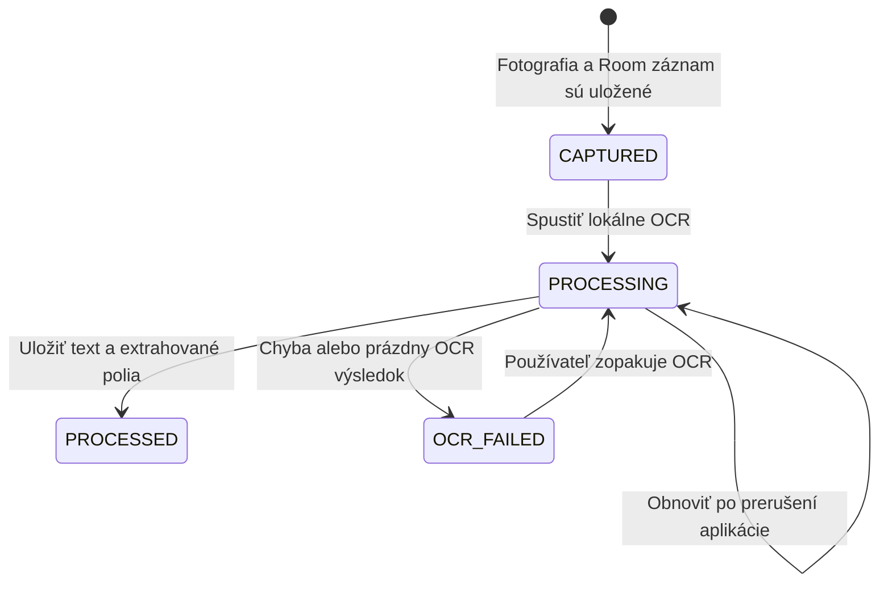

# Phase 1 – súkromný offline tracker účteniek

## Cieľ
Používateľ si nainštaluje APK na vlastný Android telefón. Otvorí aplikáciu, odfotí účtenku a bez ručného formulára ju nájde v histórii. Detail obsahuje pôvodnú fotografiu a rozpoznané údaje. Účtenka zostáva dostupná aj po zatvorení a opätovnom otvorení aplikácie.

UX: **tap → photograph → saved**.

## Hranice
Implementujeme iba Phase 1. Žiadne Phase 2/3, položky účteniek, synchronizácia, cloudové služby, Supabase, Firebase, účty ani autentifikácia. Aplikácia funguje kompletne offline vrátane prvého OCR: latinský model ML Kit je súčasťou APK. Sieť je potrebná len pri vývoji na stiahnutie nástrojov a závislostí.

## Hlavný tok a invariant
1. Otvoriť Home a zvoliť **SCAN RECEIPT**.
2. Povoliť kameru, zobraziť náhľad a odfotiť.
3. Uložiť JPEG do súkromného `filesDir/receipts` (nie cache ani verejná galéria); dokončiť zápis na disk.
4. Vložiť Room záznam so stavom `CAPTURED`.
5. Zobraziť uloženú účtenku v History, spracovanie beží na pozadí.
6. Nastaviť `PROCESSING`, spustiť OCR, uložiť celý raw text, konzervatívne extrahovať údaje a nastaviť `PROCESSED`.
7. Pri zlyhaní OCR nastaviť `OCR_FAILED`. Fotografia a záznam zostanú dostupné; detail umožní opakovanie.

**OCR sa nikdy nesmie spustiť pred trvalým uložením fotografie a databázového záznamu.** Neúspešné uloženie nesmie byť prezentované ako úspech. Chyba OCR nesmie vymazať už uložené dáta. Ak proces skončí počas ukladania alebo spracovania, pri ďalšom otvorení sa nájdu dokončené fotografie bez záznamu a obnovia sa záznamy `CAPTURED`/`PROCESSING`. Neúplné dočasné súbory sa nepovažujú za účtenku.

Fotografia a záznam existujú vo všetkých štyroch stavoch; stav opisuje iba postup spracovania.

## Obrazovky
- **Home:** veľké tlačidlo `SCAN RECEIPT`, posledné účtenky, vstup do histórie.
- **Scan / Camera:** CameraX náhľad, odfotenie jedným tlačidlom, stav ukladania, zrozumiteľné chyby a správa odmietnutého povolenia. Žiadny formulár po odfotení.
- **History:** účtenky od najnovších, obchodník alebo označenie nerozpoznanej účtenky, dátum/suma, stav a prázdny stav. Kliknutie otvára detail.
- **Receipt Detail:** pôvodná fotografia, obchodník, dátum a čas nákupu, celková suma, mena, stav a kompletný raw OCR text. Chýbajúca hodnota sa označí ako nerozpoznaná. Fotografia sa dá otvoriť vo väčšom zobrazení s priblížením. Pri OCR chybe možnosť skúsiť znova.

## Dáta
`ReceiptEntity` obsahuje minimálne:

| Pole | Význam |
|---|---|
| id | Stabilné UUID, používané aj v názve fotografie |
| imagePath | Relatívna cesta v súkromnom filesDir |
| rawOcrText | Celý OCR text; null pred OCR alebo pri jeho chybe |
| merchant | Obchodník, prípadne null |
| purchaseDate | ISO dátum `yyyy-MM-dd`, prípadne null |
| purchaseTime | Čas `HH:mm[:ss]`, prípadne null |
| totalAmount | Desatinná suma ako reťazec, nie floating point; prípadne null |
| currency | Jednoznačne rozpoznaný ISO kód, prípadne null |
| status | CAPTURED / PROCESSING / PROCESSED / OCR_FAILED |
| createdAt | Čas uloženia v epoch milisekundách |

Room/SQLite je zdroj pravdy. Prázdny OCR výsledok sa zachová a označí ako `OCR_FAILED`, aby bolo možné skúsiť znova. Úspešný OCR s nerozpoznanými poľami je `PROCESSED`; extrakcia nie je podmienkou uchovania účtenky. Nepridávame položky účtenky. Android zálohovanie vypneme, aby sa dáta automaticky neposielali do cloudu. Odinštalovanie alebo vymazanie dát aplikácie odstráni aj účtenky; Phase 1 nemá export ani zálohu.

## Konzervatívny parser
Rozpoznávame iba obchodníka, dátum, čas, celkovú sumu a menu. Použijeme jednoznačné značky (napr. `Obchodník:`, `Merchant:`, `Spolu`, `Celkom`, `Total`), platné dátumy a jednoznačné menové kódy/symboly. Nejednoznačné kandidáty alebo nemožné dátumy vracajú null. Neodhadujeme obchodníka z adresy, menu z regiónu ani total zo súčtu položiek. Americký zápis dátumu a nejednoznačný symbol `$` sa neodhadujú. Raw text je vždy dostupný, aj keď extrakcia nič nenašla.

## Architektúra
- `data`: Room entity/DAO/databáza, súkromné súbory, repository koordinujúce bezpečný tok.
- `ocr`: `ReceiptOcrService` a lokálna ML Kit implementácia.
- `parser`: `ReceiptParser` a základný konzervatívny parser.
- `ui`: Compose obrazovky, Navigation a ViewModel.
- Application vlastní jednoduchý kontajner závislostí a aplikačný CoroutineScope. Spracovanie pokračuje pri navigácii; po ukončení procesu pokračuje pri ďalšom spustení. Phase 1 negarantuje OCR počas násilne ukončenej aplikácie.

ViewModel uchováva stav obrazoviek cez zmeny konfigurácie. Coroutines vykonávajú IO mimo hlavného vlákna. Room Flow doručuje zmeny do UI. Navigation Compose spravuje Home, Camera, History a Detail. Nepoužívame DI framework ani cloudové SDK.

## Postup
1. AGENTS.md → táto špecifikácia → README.md.
2. Zostaviteľný Kotlin/Compose Android základ a závislosti.
3. Room, Home a History.
4. CameraX a lokálne uloženie fotografie.
5. ML Kit OCR a konzervatívny parser.
6. Detail a obnovenie po prerušení.
7. Unit testy parsera a bezpečnostného toku, Room test na Android zariadení, build/lint a manuálne end-to-end overenie.

## Definition of Done a manuálny checklist
- [ ] Nainštalovať debug APK na fyzický telefón (Android 8.0+).
- [ ] Zapnúť režim lietadlo ešte pred prvým spustením; povoliť kameru.
- [ ] Otvoriť Home → Scan → odfotiť reálnu účtenku bez ďalšieho formulára.
- [ ] V History sa objaví najnovšia účtenka a dokončí sa OCR.
- [ ] Detail zobrazí pôvodnú fotografiu, stav, raw text a rozpoznané polia; neisté polia sú prázdne.
- [ ] Zatvoriť/force-stop aplikáciu, otvoriť znova; fotografia aj databázový záznam zostali.
- [ ] Ukončiť aplikáciu počas OCR, otvoriť znova; spracovanie sa obnoví.
- [ ] Chyba OCR zachová obrázok/záznam a umožní opakovanie (automatizovaný test s falošným OCR service).
- [ ] Zamietnuté povolenie kamery a chyba ukladania zobrazia chybu, aplikácia nespadne.
- [ ] Rotácia/odchod z kamery nevymažú uložené účtenky.

Build a JVM testy samotné nepotvrdzujú funkčnosť fyzického fotoaparátu ani skutočné OCR; výsledky týchto overení sa uvádzajú samostatne.
